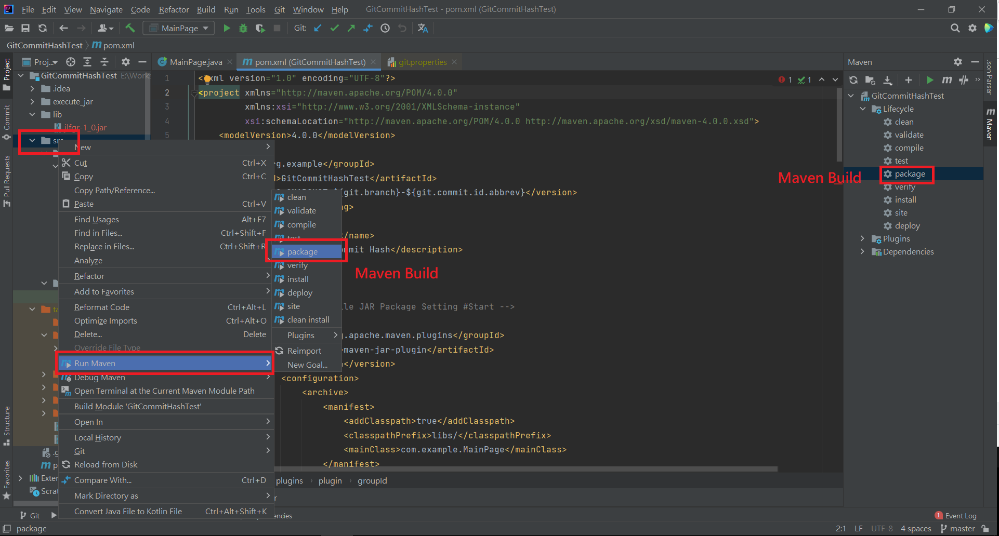

# Use IntelliJ IDEA Maven build can executive jar file. 


# Maven Build

<p align=center></p>

# Pom.xml Setting

[pom.xml](pom.xml)

# Maven Compile JAR Package Setting

```java
            <plugin>
                <groupId>org.apache.maven.plugins</groupId>
                <artifactId>maven-jar-plugin</artifactId>
                <version>2.4</version>
                <configuration>
                    <archive>
                        <manifest>
                            <addClasspath>true</addClasspath>
                            <classpathPrefix>libs/</classpathPrefix>
                            <mainClass>com.example.MainPage</mainClass>
                        </manifest>
                    </archive>
                </configuration>
            </plugin>
```

# Copy the dependent jar package to the libs directory

```java
            <plugin>
                <groupId>org.apache.maven.plugins</groupId>
                <artifactId>maven-dependency-plugin</artifactId>
                <executions>
                    <execution>
                        <id>copy-dependencies</id>
                        <phase>prepare-package</phase>
                        <goals>
                            <goal>copy-dependencies</goal>
                        </goals>
                        <configuration>
                            <outputDirectory>
                                ${project.build.directory}/libs
                            </outputDirectory>
                        </configuration>
                    </execution>
                </executions>
            </plugin>
```

# Package the dependent packages together.


```java
            <plugin>
                <groupId>org.apache.maven.plugins</groupId>
                <artifactId>maven-assembly-plugin</artifactId>
                <version>2.4</version>
                <executions>
                    <execution>
                        <phase>package</phase>
                        <goals>
                            <goal>single</goal>
                        </goals>
                    </execution>
                </executions>
                <configuration>
                    <archive>
                        <manifest>
                            <mainClass>com.example.MainPage</mainClass>
                        </manifest>
                    </archive>
                    <descriptorRefs>
                        <descriptorRef>jar-with-dependencies</descriptorRef>
                    </descriptorRefs>
                </configuration>
            </plugin>
```


# Use git-commit-id-plugin


```java
						<plugin>
                <groupId>pl.project13.maven</groupId>
                <artifactId>git-commit-id-plugin</artifactId>
                <version>4.9.10</version>
                <executions>
                    <execution>
                        <id>get-the-git-infos</id>
                        <!-- 默認綁定階段initialize -->
                        <phase>initialize</phase>
                        <goals>
                            <!-- 目標：revision -->
                            <goal>revision</goal>
                        </goals>
                    </execution>
                </executions>
                <configuration>
                    <!-- 檢查的倉庫根目錄，${project.basedir}：項目根目錄，即包含pom.xml文件的目錄 -->
                    <dotGitDirectory>${project.basedir}/.git</dotGitDirectory>
                    <!-- false：掃描路徑時不打印更多信息，默認值false，可以不配置 -->
                    <verbose>false</verbose>
                    <!-- 定義插件中所有時間格式，默認值：yyyy-MM-dd’T’HH:mm:ssZ -->
                    <dateFormat>yyyy-MM-dd HH:mm:ss</dateFormat>
                    <!-- git屬性文件中各屬性前綴，默認值git，可以不配置 -->
                    <prefix>git</prefix>
                    <!-- 生成git屬性文件，默認false：不生成 -->
                    <generateGitPropertiesFile>true</generateGitPropertiesFile>
                    <!-- 生成git屬性文件路徑及文件名，默認${project.build.outputDirectory}/git.properties -->
                    <generateGitPropertiesFilename>${project.build.outputDirectory}/git.properties</generateGitPropertiesFilename>
                    <!-- 生成git屬性文件格式，默認值properties -->
                    <format>json</format>
                    <!-- 配置git-describe命令 -->
                    <gitDescribe>
                        <skip>false</skip>
                        <always>false</always>
                        <dirty>-dirty</dirty>
                    </gitDescribe>
                </configuration>
            </plugin>
```